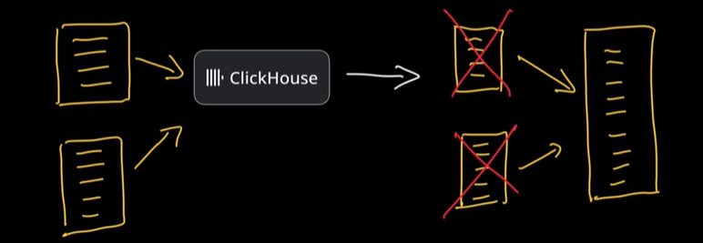
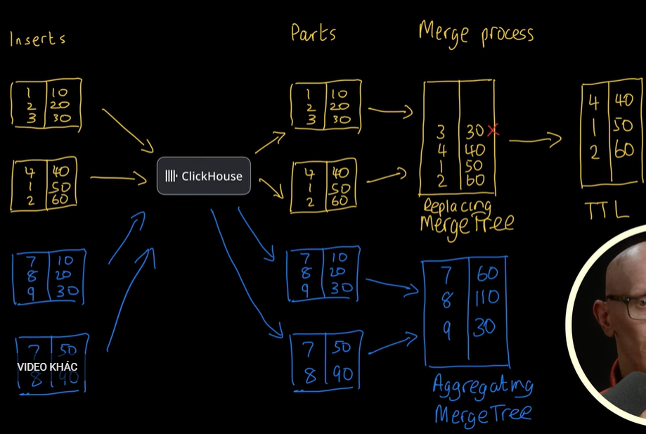

# ClickHouse
## I. Tại sao ClickHouse nhanh? 
Column-based: Lưu data theo cột.
### 1. Concurrent Inserts



- Có Data mới nó sẽ insert data part mới luôn mà ko cần sửa cấu trúc bảng như DB OLTP.
    - Ví dụ đọc index, ...
- Sau 1 thời gian nó sẽ merge ngầm các data parts lại thành big part.
    
### 2. Concurrent inserts and selects are isolated
- Đọc và ghi ko lo bị lock:
    - Query trước và trong lúc merge đọc part nhỏ
    - Query sau merge đọc big part

### 3. Tính toán thời điểm merge
- `CH` sẽ chậm ở chỗ merge.
- Các kiểu merge:
    - **Replacing Merge Tree**: Giữ phiên bản mới nhất. Bỏ record của insert chậm hơn.
    - **TTL**: Cho phép set TTL các record.
    - **Aggregating Merge**: table tính toán luôn các record giúp.
> Tự set chứ CH ko bắt buộc



### 4. Data Pruning
- Mục tiêu: Đọc càng ít data càng tốt
- 3 cách:
    - **Primary key indexes**: Đánh index cho các block (1 block mặc định ~ 8k rows)
        - ClickHouse sẽ dùng binary search để query. 
        - Khi tạo bảng ta sẽ cài order cho nó việc này tối ưu cho query.

    - **Table Projections**: 
        - Tạo 1 bảng data mới với order projection mới vì user thường query trường khác so với set up ban đầu.
        - Tối ưu query -> ko care storage.
        - Tại sao ko sửa order -> sẽ rewrite lại thú tự hết cái db -> Toang I/O.
    - **Skipping indexes**: (Nó hoạt động tương tự manifest file của IceBerg)
        - Lưu các thống kê nhanh về giá trị của cột
        - Khi query nó so sánh nhanh nếu thỏa nó đọc ELSE nó skip.
        - Các cột như PK/Order By sẽ được ClickHouse tạo metadata lưu data thống kê. Các cột khác tự set.

```sql
CREATE TABLE sales
(
    date Date,
    user_id UInt32,
    revenue Float32
)
-- Primary key indexes
ENGINE = MergeTree()
ORDER BY date
SETTINGS index_granularity = 8192;
             
-- Table Projections  
PROJECTION user_id_proj AS
SELECT *
ORDER BY user_id;

-- Tạo skipping index
ALTER TABLE sales
ADD INDEX idx_user_id user_id TYPE minmax GRANULARITY 1;
```

### 5. Data Compression
- CH nén data để tối ưu việc lưu trữ và đọc.
    - Chưa nén 10GB data
    - Nén rồi 2 GB
    - => Mặc dù việc giải nén tốn thêm bước nhưng so với tốn engine cho đọc 10GB vẫn thốn hơn. 

- CL nén theo cột vì OLAP query theo cột nhiều hơn select *.

- Cloud và On-premise sẽ dùng thuật toán nén khác nhau. 
    - Vì Cloud, họ quan tâm lưu trữ ko care compute (máy họ mạnh). 
    - Ở On-premise máy yếu hơn nên care compute và nén ít chặt hơn, ko care storage.

### 6. Xử lý song song
- Vertical: Tận dùng hết core để query
- Horizontal: shard data ra nhiều node rồi query


---
## II. ClickHouse multi-nodes


## references
[medium](https://medium.com/@suffyan.asad1/beginners-guide-to-clickhouse-introduction-features-and-getting-started-55315107399a)

[Tại sao clickhouse nhanh](https://clickhouse.com/docs/concepts/why-clickhouse-is-so-fast?source=post_page-----55315107399a---------------------------------------)